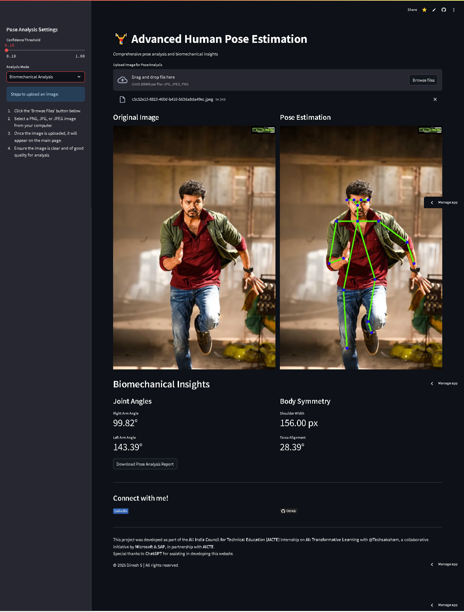

# PoseJi: Advanced Human Pose Estimation (Version 2) 🤖


**PoseJi** is an advanced human pose estimation application designed to provide comprehensive pose analysis and biomechanical insights. Leveraging state‐of‐the‐art machine learning models, the app supports real‑time detection, detailed metrics, and intuitive visualization for applications in sports analysis, fitness tracking, rehabilitation, and more.

---

## Live Demo

<div style="display: flex; justify-content: center; gap: 20px;">
    <a href="https://huggingface.co/spaces/DINESH-X/Poseji_version_1" target="_blank">
        
    </a>
    <a href="https://posejiv2.streamlit.app/" target="_blank">
        
    </a>
</div>

---

## What's New in Version 2?

**PoseJi Version 2** builds upon the solid foundation of Version 1 with several significant enhancements:
- **Enhanced Modular Code Structure:**  
  The codebase has been reorganized into more modular components. New modules for Comparison Mode, Yoga Pose Analysis, and Gesture Recognition have been added to expand the app’s functionality.
- **Expanded Analysis Modes:**  
  In addition to the modes available in Version 1 (Basic Pose Detection, Biomechanical Analysis, Detailed Metrics, 3D Pose Visualization, Video Pose Estimation, Live Webcam Pose Detection, Real‑time Posture Feedback, and Exercise Analysis & Coaching), Version 2 introduces:
  - **Comparison Mode:** Upload two images to compare pose estimations side by side.
- **Improved Performance:**  
  Optimizations in media processing and keypoint smoothing result in better real‑time performance and reduced flicker in metric displays.
- **Revamped User Interface:**  
  The user interface now features a modern, mobile-responsive design with enhanced sidebar management, improved session management, and clearer visualizations.

---

## Model Structure and Differences: Version 1 vs. Version 2

### **Version 1:**
- **Models Supported:**  
  - **OpenPose:** Uses OpenCV’s DNN module to load a frozen graph (`graph_opt.pb`) for keypoint detection.
  - **MediaPipe Pose:** Leverages Google’s MediaPipe Pose solution for efficient and real‑time pose detection.
  - **MoveNet:** Utilizes TensorFlow Lite’s MoveNet model (`movenet_lightning_fp16.tflite`) for fast and accurate pose estimation.
- **Functionality:**  
  - Basic pose detection in images and videos.
  - Webcam integration and basic metrics display.
  - Session management and data export as ZIP files.

### **Version 2:**
- **Models Supported:**  
  Version 2 continues to support the same models as Version 1, with updates to paths and improved inference (smoothing and optional preprocessing) for more stable keypoint detection.
- **New & Enhanced Features:**  
  - **Comparison Mode:** Compare two images side by side with detailed metrics and visualizations.
  - **Improved UI/UX:** A modern layout with custom CSS, enhanced sidebar instructions, and session management.
  - **Expanded Analysis Modes:** More robust modes such as advanced detailed metrics, 3D visualization, and performance optimizations for video processing.
- **Code Organization:**  
  The code is further modularized under the `poseji_v2/modules/` directory, making it easier to maintain and extend.
- **Performance:**  
  Better smoothing of keypoints and reduced flicker in real‑time metrics; efficient media handling via temporary files and dynamic frame rate adjustments.

---

## Features

- **Real-time Pose Detection:**  
  Analyze images and videos using advanced models for fast and accurate pose estimation.
- **Customizable Settings:**  
  Adjust confidence thresholds, calibration factors, and more.
- **Multiple Analysis Modes:**  
  Choose from:
  - Basic Pose Detection
  - Biomechanical Analysis (angles, posture evaluation)
  - Detailed Metrics
  - 3D Pose Visualization
  - Video Pose Estimation
  - Live Webcam Pose Detection
  - Real‑time Posture Feedback
  - Exercise Analysis & Coaching
  - Comparison Mode
  - Session History
- **Video & Image Processing:**  
  Upload images (PNG, JPG, JPEG) and videos (MP4, AVI, MOV, GIF) for detailed analysis.
- **Live Webcam Integration:**  
  Access the webcam for live pose estimation with real‑time feedback.
- **Session Management:**  
  Save session outputs and download all results as a ZIP file.
- **User-Friendly Interface:**  
  Modern, mobile-responsive layout with a dynamic sidebar for easy navigation.

---

## Project Structure

```plaintext
itzdineshx-edunet_ai_internship_2025/
├── README.md
├── LICENSE
├── packages.txt
├── requirements.txt
├── assets/
│   └── images/
│       └── videos/
├── Demo/
│   ├── images/
│   └── videos/
│       └── streamlit-app-2025-01-26-20-01-13.webm
├── internship_files/
├── models/
│   ├── graph_opt.pb
│   ├── movenet_lightning_fp16.tflite
│   └── saved_model.pb
├── poseji_v2/
│   ├── app.py
│   └── modules/
│       ├── __init__.py
│       ├── comparison_mode.py
│       ├── config.py
│       ├── graph_opt.pb
│       ├── helpers.py
│       ├── image_analysis.py
│       ├── main_ui.py
│       ├── movenet_lightning_fp16.tflite
│       ├── pose_estimators.py
│       ├── session_history.py
│       ├── video_estimation.py
│       ├── webcam_transformers.py
│       └── __pycache__/
├── src/
│   ├── app.py
│   ├── graph_opt.pb
│   ├── movenet_lightning_fp16.tflite
│   ├── saved_model.pb
│   └── app/
│       ├── advanced_pose_app.py
│       ├── app.py
│       ├── pose_estimation.py
│       ├── pose_estimation_Video.py
│       ├── test.py
│       └── test2.py
└── .devcontainer/
    └── devcontainer.json
```

---

## Model Details

The application supports multiple pose estimation models:

- **OpenPose:**  
  Uses OpenCV’s DNN module to load the `graph_opt.pb` model for detecting keypoints and drawing skeletal connections.

- **MediaPipe Pose:**  
  Utilizes MediaPipe’s Pose solution for efficient, real‑time pose estimation with built‑in drawing utilities for skeleton visualization.

- **MoveNet:**  
  Employs TensorFlow Lite’s MoveNet model (`movenet_lightning_fp16.tflite`) for high-speed, accurate pose detection.

---

## App Interface

### Pose Analysis Settings
- **Confidence Threshold:**  
  Adjust the minimum confidence level for keypoint detection.
- **Calibration Factor:**  
  Scale distance-based metrics for personalized analysis.
- **Analysis Mode:**  
  Select from:
  - Basic Pose Detection
  - Biomechanical Analysis (angles, posture evaluation)
  - Detailed Metrics
  - 3D Pose Visualization
  - Video Pose Estimation
  - Live Webcam Pose Detection
  - Real‑time Posture Feedback
  - Exercise Analysis & Coaching
  - Comparison Mode
  - Session History
- **Exercise Analysis:**  
  Choose an exercise type (currently supports Squats) for tracking repetitions.

### Upload Section
- **Image Upload:**  
  Drag and drop PNG, JPG, or JPEG files.
- **Video Upload:**  
  Upload MP4, AVI, MOV, or GIF files for detailed pose analysis.
- **Live Webcam:**  
  Access live video feed for instant pose estimation.

### Output and Session Management
- **Realtime Metrics:**  
  View live updates on joint angles and other metrics during processing.
- **Download Options:**  
  Download individual outputs (images, videos, metrics) or all session outputs as a ZIP archive.
- **Session History:**  
  Save and review previous sessions with detailed logs and metrics.

---

## Demo

### Demo Video


### Sample Image


### Sample Video


---

## How to Run the App

### Prerequisites
- Python 3.8 or higher  
- Install dependencies with:
  ```bash
  pip install -r requirements.txt
  ```

### Running the Application
1. Navigate to the `src` directory.
2. Start the Streamlit app:
   ```bash
   streamlit run app.py
   ```
3. Open the provided URL in your browser to interact with the app.

---

## Use Cases

- **Sports Training:**  
  Analyze and optimize athletes' movements.
- **Fitness Tracking:**  
  Monitor posture and exercise form to improve workouts.
- **Rehabilitation:**  
  Track progress in physical therapy and recovery.
- **Gaming & AR/VR:**  
  Integrate pose estimation into interactive applications.

---

## Future Enhancements

- **Advanced Real-Time Feedback:**  
  More in-depth posture analysis and exercise coaching.
- **Multi-Person Detection:**  
  Extend support for multiple people in a single frame.
- **Mobile Optimization:**  
  Further enhance the mobile user experience.
- **Integration APIs:**  
  Offer REST APIs for third-party integration.

---

## Contributors

This project is part of the **Edunet AI Internship 2025** program. Contributions are welcome to further enhance functionality and extend features.

---

## License

This project is licensed under the **Apache License 2.0**. See the [LICENSE](LICENSE) file for more details.

---

## Author

**DINESH S**  
<h3>Connect with me:</h3>
<a href="https://www.linkedin.com/in/dinesh-x/" target="_blank">
  
</a>
<a href="https://github.com/itzdineshx/Edunet_AI_internship_2025" target="_blank">
  
</a>
<a href="mailto:personalaccdinesh@gmail.com" target="_blank">
  
</a>

---

**PoseJi © 2025 DINESH S All Rights Reserved**
